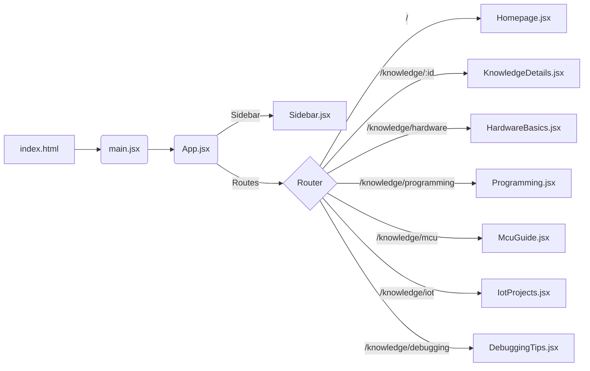
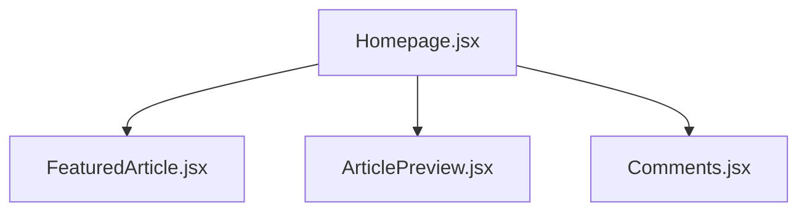

# NEBULA KNOWLEDGE 项目概览与结构梳理

本文档梳理项目技术栈、运行链路、目录与文件作用、组件与路由关系、样式与静态资源使用情况，并列出冗余清单与优化建议。

更新日期：2025-09-20

---

## 1. 技术栈与运行方式

- 构建工具：Vite 7
- 前端框架：React 19
- 路由：React Router DOM 7
- 语言与模块：ESM，type: module
- 常用脚本：
  - 开发：`npm run dev`
  - 构建：`npm run build`
  - 预览：`npm run preview`
  - Lint：`npm run lint`

---

## 2. 运行链路（自上而下）

1) public/index.html  
   - 注入根节点 `<div id="root">`  
   - 以模块方式加载 `/src/main.jsx`

2) src/main.jsx  
   - `createRoot(...).render(...)` 挂载 React  
   - 包裹 `<BrowserRouter>` 提供路由上下文  
   - 渲染 App

3) src/App.jsx  
   - 定义全局布局：`Sidebar` + `main` 主内容  
   - 定义 `Routes`：  
     - `/` → `Homepage`  
     - `/knowledge/:id` → `KnowledgeDetails`  
     - `/knowledge/hardware` → `HardwareBasics`  
     - `/knowledge/programming` → `Programming`  
     - `/knowledge/mcu` → `McuGuide`  
     - `/knowledge/iot` → `IotProjects`  
     - `/knowledge/debugging` → `DebuggingTips`  
   - 提供“返回顶部”按钮

4) 页面与组件层  
   - `Sidebar`：目录导航、热门标签、搜索框；使用 `useNavigate` 跳转并通过 `currentView` 控制高亮  
   - `Homepage`：组合 `FeaturedArticle`、`ArticlePreview`、`Comments`  
   - `KnowledgeDetails`：基于 `useParams` 读取 `id` 渲染富文本与相关文章链接  
   - 其他专题页：`HardwareBasics / Programming / McuGuide / IotProjects / DebuggingTips`

---

## 3. 目录树（已核验）

```
.
├─ .gitignore
├─ CODEBUDDY.md
├─ eslint.config.js
├─ index.html
├─ package.json
├─ package-lock.json
├─ README.md
├─ vite.config.js
├─ public
│  ├─ vite.svg
│  └─ images
│     ├─ blackhole-background.png
│     └─ gemini-2.5-...去掉文字并高清.png
└─ src
   ├─ App.css
   ├─ App.js            (疑似冗余：未被引用，使用的是 App.jsx)
   ├─ App.jsx
   ├─ index.css
   ├─ main.jsx
   ├─ notes.js          (疑似冗余：未被引用)
   ├─ assets
   │  ├─ images/        (疑似冗余：未被引用)
   │  └─ react.svg      (疑似冗余：未被引用)
   ├─ components
   │  ├─ ArticlePreview.css
   │  ├─ ArticlePreview.jsx
   │  ├─ Comments.css
   │  ├─ Comments.jsx
   │  ├─ DebuggingTips.jsx
   │  ├─ FeaturedArticle.css
   │  ├─ FeaturedArticle.jsx
   │  ├─ HardwareBasics.jsx
   │  ├─ Homepage.css
   │  ├─ Homepage.jsx
   │  ├─ IotProjects.jsx
   │  ├─ KnowledgeDetails.css
   │  ├─ KnowledgeDetails.jsx
   │  ├─ LeftSidebar.css    (疑似冗余：未被引用)
   │  ├─ LeftSidebar.jsx    (疑似冗余：未被引用)
   │  ├─ MainContent.css    (疑似冗余：未被引用)
   │  ├─ MainContent.jsx    (疑似冗余：未被引用)
   │  ├─ McuGuide.jsx
   │  ├─ NoteContent.jsx    (疑似冗余：未被引用)
   │  ├─ Sidebar.css
   │  ├─ Sidebar.jsx
   │  └─ navigation.css     (疑似冗余：未被引用)
   └─ utils/
```

---

## 4. 路由与组件关系图

- 路由图（Mermaid）



- 主页组合关系



---

## 5. 各文件/目录作用说明

- 根目录
  - index.html：页面入口，挂载 root，加载 main.jsx
  - vite.config.js：Vite 配置
  - package.json：依赖与脚本
  - eslint.config.js：ESLint 配置
  - README.md / CODEBUDDY.md：说明/辅助文档

- public/
  - vite.svg：Favicon（被 index.html 引用）
  - images/*.png：当前未发现引用（详见冗余清单）

- src/
  - main.jsx：应用挂载与 Router 包裹
  - App.jsx：全局布局与路由定义；搭配 App.css
  - index.css：全局样式
  - App.css：应用级样式（被 App.jsx 引用）
  - App.js：旧版本入口（未引用）
  - notes.js：散落笔记（未引用）
  - assets/：静态资源目录（本项目未引用 react.svg 与 images/）
  - components/
    - Sidebar(.jsx/.css)：左侧导航、搜索、热门标签；用 useNavigate 路由跳转
    - Homepage(.jsx/.css)：主页聚合内容区块
    - FeaturedArticle(.jsx/.css)：特色文章卡片
    - ArticlePreview(.jsx/.css)：文章预览列表
    - Comments(.jsx/.css)：评论区模块
    - KnowledgeDetails(.jsx/.css)：详情页，基于 id 渲染富文本与相关文章
    - HardwareBasics / Programming / McuGuide / IotProjects / DebuggingTips：专题页面
    - LeftSidebar / MainContent / NoteContent / navigation.css：未被引用的历史/备选实现

- src/utils/：当前为空（或未包含可见文件）

---

## 6. 业务逻辑与数据流

- 导航：Sidebar 维护本地 `currentView` 高亮；点击目录项通过 `useNavigate` 切路由；App 通过状态提升让 Sidebar 控制当前视图高亮。
- 页面展示：
  - `/` 使用 Homepage 聚合多个板块组件
  - `KnowledgeDetails` 使用 `useParams()` 获取 `id`，从内置 `knowledgeData` 选择当前条目并用 `dangerouslySetInnerHTML` 渲染
  - 相关文章为本地数组 `relatedArticles`，跳转同一详情路由
- 样式与资源：每组件对应同名 CSS；全局样式统一在 index.css；部分 public/images 与 src/assets 未被使用。

---

## 7. 冗余清单（未被引用）

已通过全局检索与交叉验证，以下文件/目录未被任何组件或样式引用：

- 组件与样式
  - src/components/LeftSidebar.jsx
  - src/components/LeftSidebar.css
  - src/components/MainContent.jsx
  - src/components/MainContent.css
  - src/components/NoteContent.jsx
  - src/components/navigation.css

- 源码与资产
  - src/notes.js
  - src/App.js（当前使用 App.jsx）
  - src/assets/react.svg
  - src/assets/images/（整个目录未检出引用）

- 公共资源
  - public/images/blackhole-background.png
  - public/images/gemini-2.5-...png

说明：若这些文件为未来规划或暂存素材，请在 README 中标注用途；否则建议清理以减小体积与认知负担。

---

## 8. 风险点与改进建议

- 详情页富文本：`dangerouslySetInnerHTML` 建议改为受控渲染（如 Markdown → React 组件），并将大体量内容外置为 JSON/MD，结合 `React.lazy` 懒加载。
- 资源治理：移除未用图片与 assets，避免构建产物膨胀；或者集中到 `public/assets/` 并统一引用。
- 代码一致性：统一使用 `App.jsx`，删除重复的 `App.js`；若需要 TS 或更严格类型，可引入 TS 与 props 校验。
- 路由与 SEO：为各路由设置 `meta`（如 react-helmet-async）与面包屑来源统一管理。
- 组件内聚：Sidebar 的热门标签/搜索可与实际数据联动；当前为静态占位。

---

## 9. 快速检查清单（供后续维护）

- [ ] 删除列出的冗余文件/目录或在文档中注明保留原因  
- [ ] 外置 KnowledgeDetails 内容并懒加载  
- [ ] 对资源与图片进行体积优化与按需导入  
- [ ] 为关键页面添加骨架屏与路由级代码分割  
- [ ] Lint/Prettier 规则与 CI 校验一致化

---

## 10. 参考文件与关键路径

- 入口：`index.html` → `/src/main.jsx` → `/src/App.jsx`
- 导航：`/src/components/Sidebar.jsx`
- 主页：`/src/components/Homepage.jsx`
- 详情：`/src/components/KnowledgeDetails.jsx`